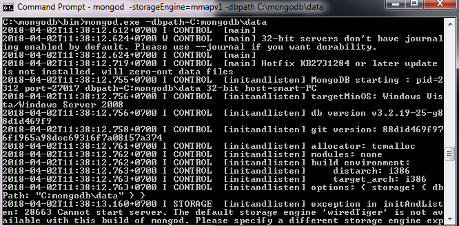
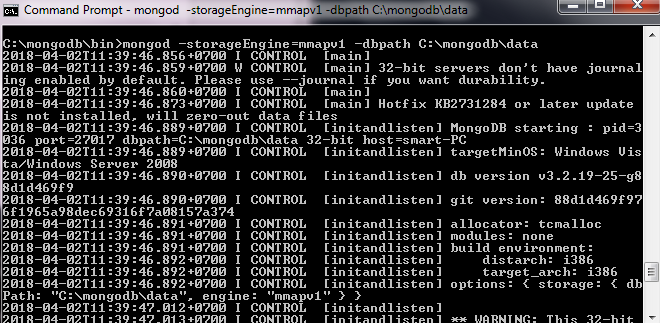
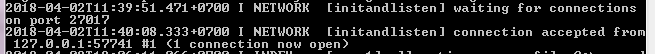
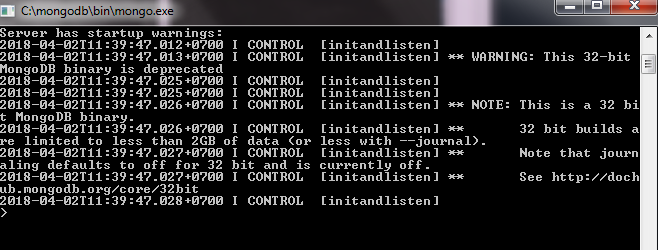
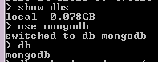
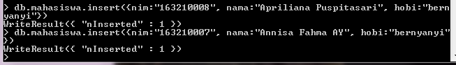
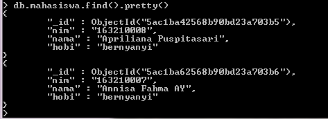
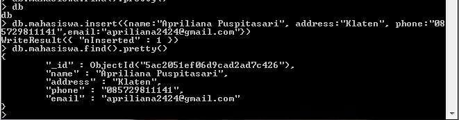

##**Membuat database menggunakan MongoDB**
====================

**Cara menggunakan MongoDB untuk membuat database :
Pertama untuk dapat menjalankan mongodb kita harus masuk pada direktori mongodb setelah menginstallnya.
Setelah menginstal mongodb maka kita buka mongodb dalam CMD.
Pertama-tama buka mongodb\bin dalam CMD.**
---

**Jika sudah masuk dalam folder kita mengetikkan perintah seperti dibawah ini mongod.exe –dbpath=C:\mongodb\data**
untuk dapat mengaktifkan server.
---

*Karena ketika dijalankan terjadi error dengan terdapat tanda rc100 maka untuk dapat menambahkan perintah*
*mengaktifkan server perlu ditambah perintah mongod –storageEngine=mmapv1 –dbpath C:\mongodb\data.*
---

*Setelah berhasil menginstal perintah storageEngien tersebut maka akan muncul connection accepted from*
*127.0.0.1:57741 #1 (1 connection now open) maka mongodb sudah berhasil dibuka. Setelah berhasil dibuka maka*
*buka program mongo.exe.*
---

*Masuk kedalam mongo.exe maka dapat memulai membuat database. Buat database mongodb.*
---

*Untuk membuat database menggunakan perintah use kemudian mongodb.*
---

*Setelah database masuk maka kita tambahkan data kedalam database dengan menggunakan perintah insert*
*seperti dibawah ini.*
---

*Menampilkan hasil data dari database menggunakan perintah dibawah ini :*
---

*Dibawah ini merupakan database yang diambil dari variabel pada browser yang ada dalam repo pak bambang.*
---

